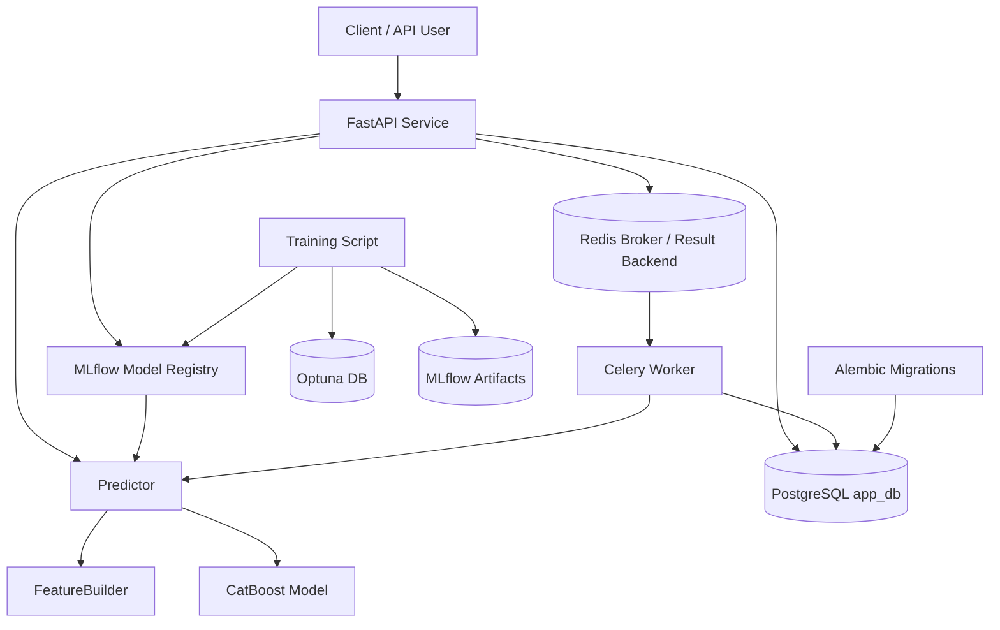
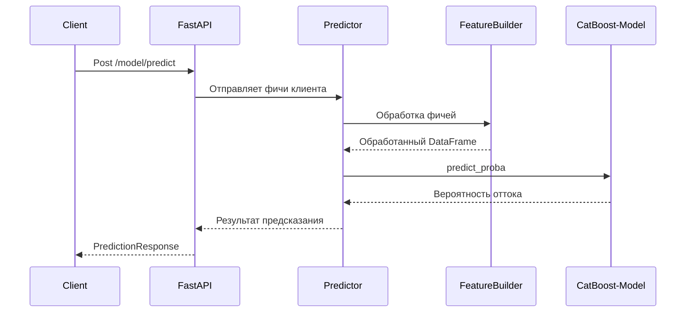
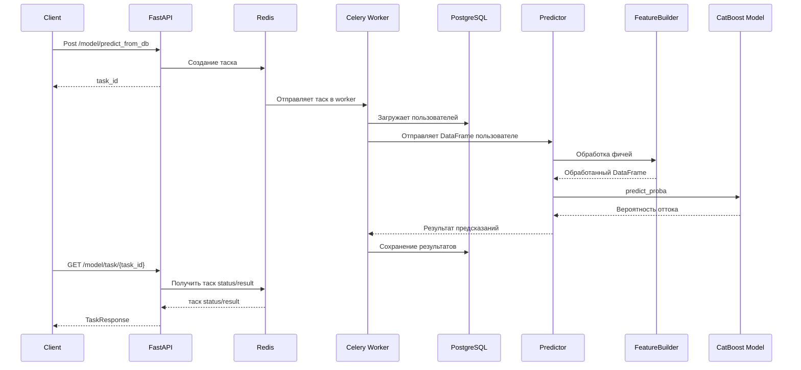

# Архитектура проекта

```mermaid
flowchart TD
    Client[Client / API User] --> FastAPI[FastAPI Service]

    FastAPI --> Predictor[Predictor]
    Predictor --> FeatureBuilder[FeatureBuilder]
    Predictor --> CatBoost[CatBoost Model]

    FastAPI --> MLflow[MLflow Model Registry]
    MLflow --> Predictor

    FastAPI --> Postgres[(PostgreSQL app_db)]
    FastAPI --> Redis[(Redis Broker / Result Backend)]

    Redis --> Celery[Celery Worker]
    Celery --> Predictor
    Celery --> Postgres

    Train[Training Script] --> Optuna[(Optuna DB)]
    Train --> MLflow
    Train --> Artifacts[(MLflow Artifacts)]

    Alembic[Alembic Migrations] --> Postgres
```

# Flow Предсказания

```mermaid
sequenceDiagram
    participant Client
    participant API as FastAPI
    participant PR as Predictor
    participant FB as FeatureBuilder
    participant Model as CatBoost-Model
    
    Client ->> API: Post /model/predict
    API ->> PR: Отправляет фичи клиента
    PR ->> FB: Обработка фичей
    FB -->> PR: Обработанный DataFrame
    PR ->> Model: predict_proba
    Model -->> PR: Вероятность оттока
    PR -->> API: Результат предсказания
    API -->> Client: PredictionResponse
```

# Flow Предсказания для бд

```mermaid
sequenceDiagram
    participant Client
    participant API as FastAPI
    participant Redis as Redis
    participant Worker as Celery Worker
    participant DB as PostgreSQL
    participant PR as Predictor
    participant FB as FeatureBuilder
    participant Model as CatBoost Model
    
    Client ->> API: Post /model/predict_from_db
    API ->> Redis: Создание таска
    API -->> Client: task_id
    
    Redis ->> Worker: Отправляет таск в worker
    Worker ->> DB: Загружает пользователей
    Worker ->> PR: Отправляет DataFrame пользователе
    PR ->> FB: Обработка фичей
    FB -->> PR: Обработанный DataFrame
    PR ->> Model: predict_proba
    Model -->> PR: Вероятность оттока
    PR -->> Worker: Результат предсказаний
    Worker ->> DB: Сохранение результатов
    
    Client ->> API: GET /model/task/{task_id}
    API ->> Redis: Получить таск status/result
    Redis -->> API: таск status/result
    API -->> Client: TaskResponse
```