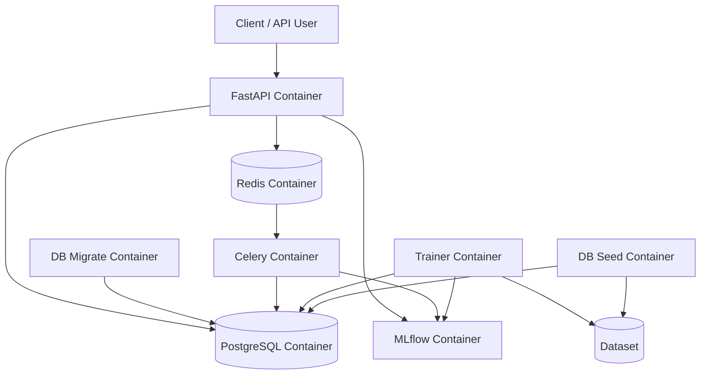

# Схема Doker Compose

---

# Описание сервисов

| Сервис          | Описание                                                           |
|:----------------|:-------------------------------------------------------------------|
| `postgres`      | PostgreSQL-база данных для клаентов, предсказаний, MLflow и Optuna |
| `redis`         | Broker и Backend для Celery                                        |
| `mlflow`        | MLflow Сервер и Model Registry                                     |
| `celery-worker` | Celery worker для асинхронных batch-предсказаний                   |
| `fastapi`       | FastAPI-сервис для получения предсказаний                          |
| `trainer`       | One-shot контейнер для обучения модели                             |
| `db-migrate`    | One-shot контейнер для применения Alembic миграций                 |
| `db-seed`       | One-shot контейнер для саполнения PostgreSQL данными из .csv файла |

---

## Docker volumes

| volume            | Описание                   |
|:------------------|:---------------------------|
| postgres_data     | Хранение данных PostgreSQL |
| redis_data        | Хранение данных Redis      |
| mlflow_artifacts  | Хранение MLflow artifacts  |